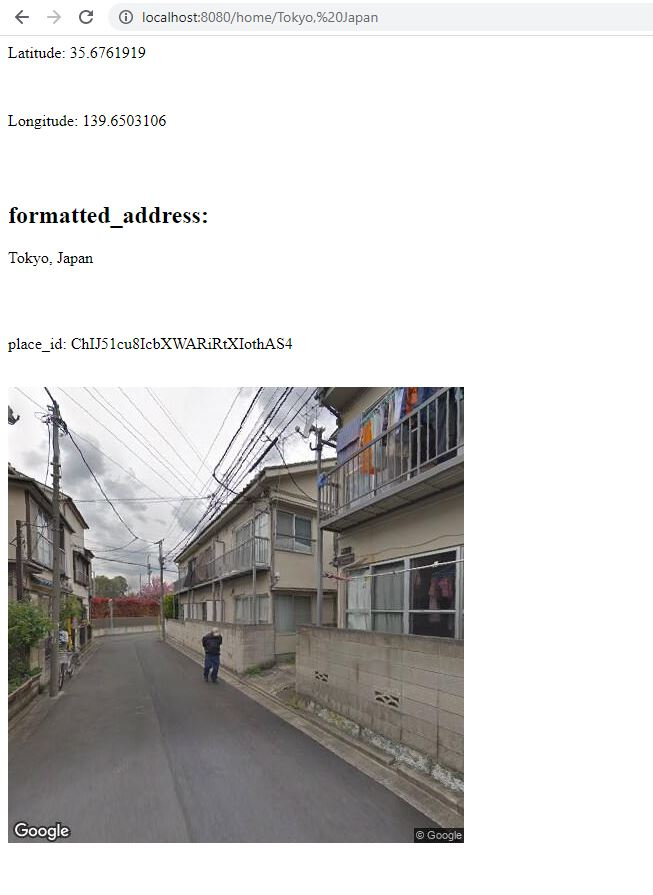

# get_all_address_info_api
this is flask restful API, using Google Geocoding API and google static street view API, to provide information about place which is geolocation , image for street with sqlite db to store requests and handle errors and store errors 


# what you need to use

your google api key must support static street view API and Gecodding API
edit this  
* ```appkey = "your google api key must support static street view API and Geocoding API"```


# app:


# Security

* there was big issue in the app it return the src of the image contains the google appid or api key
* to solve this when I got the image I download it on my own server then render it with my own src not include appid
